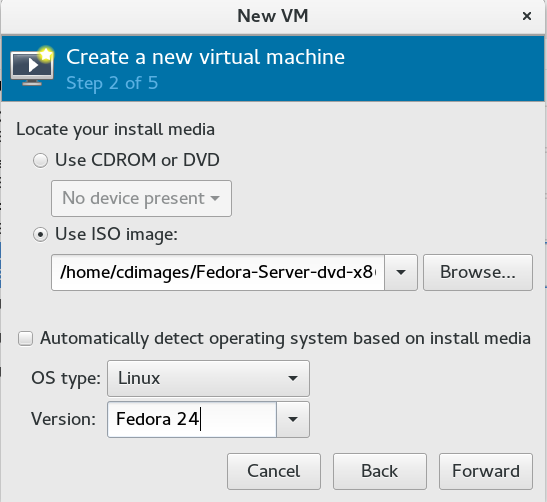
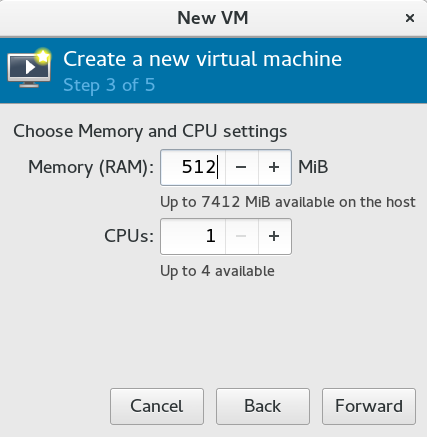
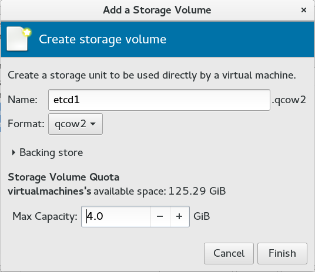
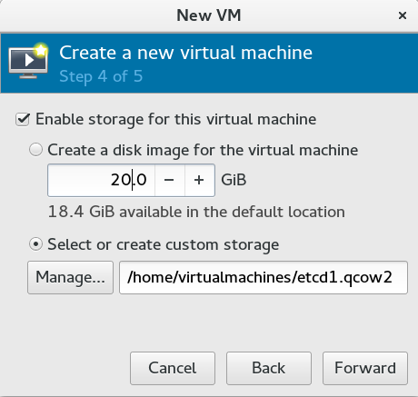
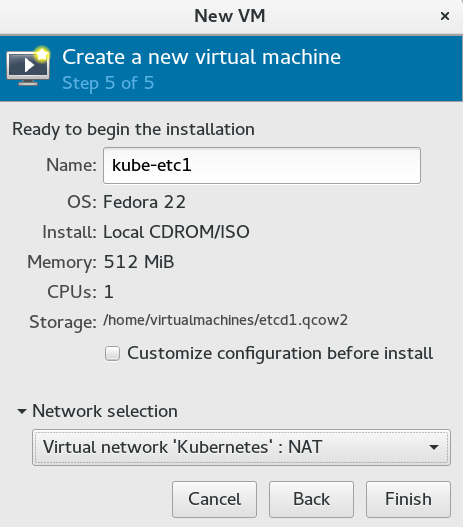
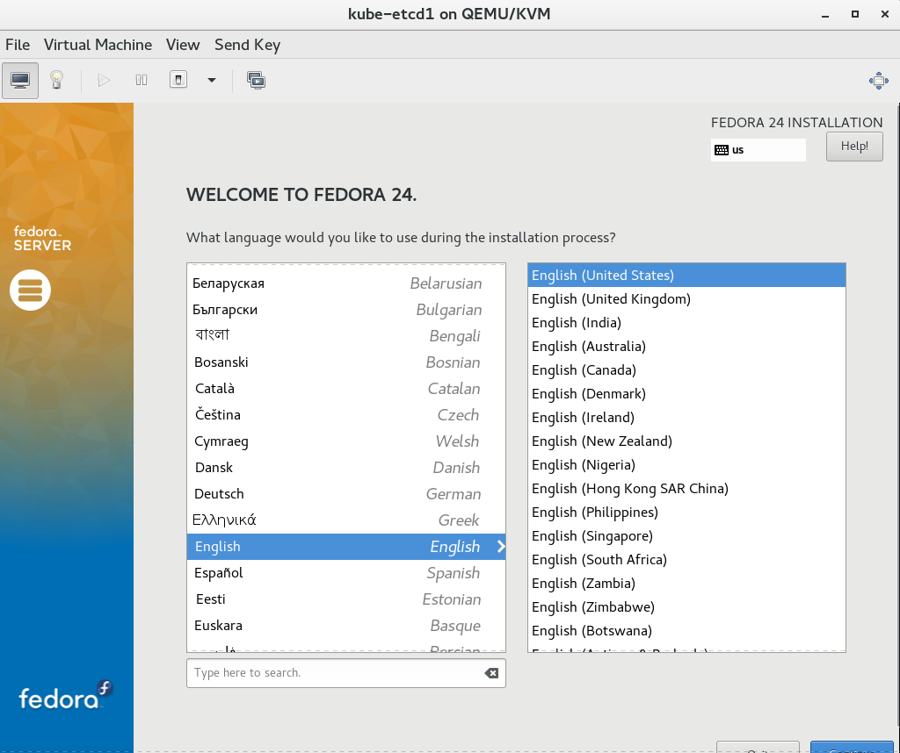
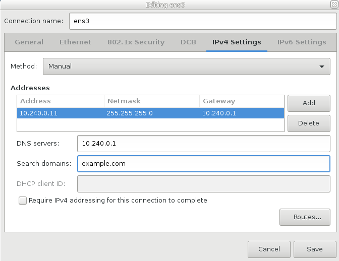
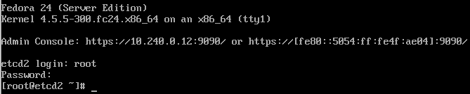

Kubernetes ebook
# Chapter 2: Setup Infrastructure

**todo- editor**: I have merged chapter 2 and 3 (from the original outline) together to form chapter 2.

* Write about what type of hardware is needed. If not physical hardware, then what size of VMs are needed. etc.
* Discuss what type of network technologies are we going to use. Such as flannel or CIDR, etc.
* This will be a relatively short chapter.
* (# Chapter 3: Provisioning of machines, Network setup)
* Here we provision our machines, and also setup networking.
* This will have a couple of diagrams

This chapter will discuss how we setup our infrastructure. The setup we are using is VMs running on Libvirt/KVM on my local work computer, which is the closest to bare-metal installation if one does not have actual bare-metal hardware. It is still possible to run this setup on AWS or GCE or any other cloud provider of your choice though. You should also note that the networking component is a little different for each cloud provider. 


## How many VMs and what size?

As we know from [chapter 1](chapter01.md), Kubernetes has three main components. These three components are:

* Etcd 
* Control plane (comprising of: API Server, Scheduler, Controller Manager) 
* Worker(s) 

It is technically possible to have all these components on a single machine; though a minimum of three nodes are recommended, one for each component. Even if you use a dedicated node for each component, there would be no high availability though and no traffic coming in from outside (unless you use something called *NodePort* - more about this later). To make sure that the incoming traffic can reach the pods, we also need an additional component called a load balancer. In my opinion it is a component which is missing from the Kubernetes software at the moment. Just like when you buy a camera, an important component of the camera is missing, which is called a **tripod** :). You need to additionally buy this missing component when you buy a camera. Similarly you need to setup/add a load balancer when you setup a Kubernetes cluster.

Since we hope to have high availability not only for our pods, but also for other components of our cluster, we would be using the following number and size of the nodes.

* 3 x Etcd nodes -		Each with: 0.5 GB RAM, 4 GB disk 
* 2 x Control plane nodes -	Each with: 0.5 GB RAM, 4 GB disk 
* 2 x Worker nodes - 		Each with: 1.5 GB RAM, 20 GB disk
* 2 x Load Balancer nodes -	Each with: 0.5 GB RAM, 4 GB disk

That makes a total of nine (9) nodes.


Though not abolsulutely necessary, we also need a shared storage solution to demonstrate the concept of network mounted volumes (todo - ????) . We *can* use the Load balancer nodes to setup NFS and make it Highly available.

**Note about NodePort:**
In Kubernetes, `NodePort` is way to expose a service to the outside world - when you specify it in the `kubectl expose <service> --type=NodePort` (todo - confirm / verify). What this does is that it allows you to expose a service on the worker node, just like you can do the port mapping on a simple docker host. This makes the service available through all the worker nodes, because node port works it's magic by setting up certain iptables rules on all worker nodes. So no matter which port you land on (from outside the cluster), the service responds to you. However, to do this, you need to have the external DNS pointing to the worker nodes. e.g. www.example.com can have two A type addresses in DNS pointing to the IP addresses of two worker nodes. In case a node fails, DNS will do it's own DNS round robin. This may work, but DNS round robin does not work well with sticky sessions. Also, managing services through ports is kind of difficult to manage / keep track of. Plus it is totally uncool! (todo: editor can remove this if unhappy :(  ).


## The choice of HA technology for etcd, controller and load balancers:

We selected three nodes for the etcd service. First, because it stores the meta data about our cluster, which is most important. Secondly etcd nodes can form their own individual/independent cluster. To satisfy the needs of a quorum, we decided to use three nodes for etcd cluster. This means failure of one node does not affect the etcd operation. (todo: rewrite:) In order for etcd cluster to be healthy, it needs to have quorum. i.e. alive nodes being more than half of the size of the total number of nodes of etcd cluter. So having a total of two nodes is not helpful. When one fails, the etcd custer will instantly become unhealthy. This is what we do not want to happen in a production cluster.

We know that all Kubernetes components watch the API server, running on controller node. So making sure that control plane remains available at all times. Unfortunately, controller nodes are not cluster aware. So we need to provide some sort of HA for them. This high availability can be provided in two ways. 

* By setting up a proxy/load balancer (using HAProxy on our load balancer). This would mean that the load balancer has to be the first component to come alive when the cluster boots up. So cluster has dependency on the load balancer nodes. This is easier to setup but has dependency problem.
* By setting up IPVS/LVS (using heartbeat, etc) on the controller nodes themselves, and only have a floating IP/VIP on the two nodes. This way we do not have to wait for the load balancer to come up before the rest of the cluster. We then use this *Controller VIP* in the worker nodes to point to controller node. This involves installing and configuring some HA software on controller nodes, but does not have dependency problems.

We believe the second method holds more value, so we go for it. Although just for completeness sake, we will also show a method to do it through HAProxy.

(todo: Load balancers use: (using IPVS/LVS + Heartbeat))


**todo:** In case we use IPVS, would we need additional STONITH device to prevent split brain syndrome? 


## DNS names:
It is understood that all nodes in this cluster will have some hostname assigned to them. It is important to have consistent hostnames, and if there is a DNS server in your infrastructure, then it is also important what are the reverse lookup names of these nodes. This information is  critical at the time when you will generate SSL certificates. 

The dns domainname we will use in this setup is `example.com` . Each node will have a hostname in the form of `*hostname*.example.com` . 


## Operating System:
We are using Fedora 24 64 bit server edition - on all nodes (Download from [here](https://getfedora.org/en/server/download/) ). You can use a Linux distribution of your choice. 
For poeple wanting to use Fedora Atomic, we would like to issue a warning. Fedora Atomic is a collection of binaries (etcd, kubernetes) bundled together (in a read only  filesystem), and individual packages *cannot* be updated. There is no yum/dnf, etc. In this book we are using Kubernetes 1.3 (the latest version), which is still not part of Fedora Atomic 24, so we decided to use Fedora 24 server edition (in minimal configuration), and added the packages we need directly from their official websites.

# Supporting software needed for this setup:
* Kubernetes - 1.3.0 or later (Download latest from Kubernetes website)
* etcd - 2.2.5 or later (The one that comes with Fedora is good enough)
* Docker - 1.11.2 or later (Download latest from Docker website)
* CNI networking [https://github.com/containernetworking/cni](https://github.com/containernetworking/cni)
* Linux IPVS, heartbeat / pacemaker (todo) 


# Expectations

With the infrastructure choices made above, we have hope to have the following working on our Kubernetes cluster.

* 3 x etcd nodes (in H/A configuration) 
* 2 x Kubernetes controller nodes (in H/A configuration) 
* 2 x Kubernetes worker nodes
* SSL based communication between all Kubernetes components
* Internal Cluster DNS (SkyDNS) - as cluster addon
* Default Service accounts and Secrets
* Load Balancer (in H/A configuration)

# Infrastructure layout / network layout:

Our cluster, when complete, will look something like this: 

(todo : re-draw diagram to accomodate mutiple load balancers, and VIPs, etc).


# Infrastructure provisioning

Note that I am doing this provisioning on my work computer, which is Fedora 23 64 bit, and I will use the built in Libvirt/KVM for virtualization. You can use any other virtualization software, or use real hardware!

First, setting up the new infrastructure network in KVM.

## Setup new virtual network in KVM:

Start Virtual Machine Manager and go to "Edit"->"Connection Details"->"Virtual Networks" . Then follow the steps shown below to create a new virtual network. Note that this is a NAT network, connected to any/all physical devices on my computer. So whether I am connected to wired network, or wireless, it will work.


The wizard will create an internal DNS setup (automatically) for example.com .

Now, we have the network out of the way, I will start creating VMs and attach them to this virtual network.


## IP addresses and VM provisioning:

Here are the sizes (and related IP addresses) of VMs I am creating:

* etcd1		512 MB RAM	4 GB disk	10.240.0.11/24
* etcd2		512 MB RAM	4 GB disk	10.240.0.12/24
* etcd3		512 MB RAM	4 GB disk	10.240.0.13/24
* controller1	512 MB RAM	4 GB disk	10.240.0.21/24
* controller2	512 MB RAM	4 GB disk	10.240.0.22/24
* worker1	1.5 GB RAM	20 GB disk	10.240.0.31/24
* worker2	1.5 GB RAM	20 GB disk	10.240.0.32/24
* lb1		512 MB RAM	4 GB disk	10.240.0.41/24
* lb2		512 MB RAM	4 GB disk	10.240.0.42/24

**Notes:**
* There will be (additional) floating IP/VIP for controllers, which will be: `10.240.0.20` 
* There will be (additional) floating IP/VIP for load balancers, which will be: `10.240.0.40` 
* If you decide to use HAProxy to provide HA for controller nodes, then you can use the the load balancer's VIP (for port 6443), instead of having a dedicated (floating/V) IP for control plane.


**More Notes:** 
* Kelsey's Kubernetes guide (the one this book uses as a reference), starts the node numbering from 0. We start them from 1 for ease of understanding.
* The FQDN of each host is `*hostname*.example.com` 
* The nodes have only one user, **root** ; with a password: **redhat** .
* I used libvirt's GUI interface (virt-manager) to create these VMs, but you can automate this by using CLI commands.


## Screenshots from actual installation











**Notes:** 
* One of the installation screen shows OS as Fedora 22 (Step 5 of 5); but it is actually Fedora 24. Libvirt is not updated yet to recognize Fedora 24 ISO images.
* The last screenshot is from the installation of second etcd node (etcd2). (todo: may be we can get a new screenshot?)


## Actual resource utilization from a running Kubernetes cluster.
To give you an idea about how much RAM (and othere resources) are actually used by each type of node, we have provided some details from the nodes of a similar Kubernetes cluster. It should help you size your VMs accordingly. Though for production setups, you definitely want more resources for each component. 


### etcd:
Looks like etcd uses very little RAM! (about 88 MB!). I already gave this VM the minimum of 512 MB of RAM.

```
[root@etcd1 ~]# ps aux | grep etcd
root       660  0.2  9.2 10569580 46508 ?      Ssl  Sep14  16:31 /usr/bin/etcd --name etcd1 --cert-file=/etc/etcd/kubernetes.pem --key-file=/etc/etcd/kubernetes-key.pem --peer-cert-file=/etc/etcd/kubernetes.pem --peer-key-file=/etc/etcd/kubernetes-key.pem --trusted-ca-file=/etc/etcd/ca.pem --peer-trusted-ca-file=/etc/etcd/ca.pem --initial-advertise-peer-urls https://10.240.0.11:2380 --listen-peer-urls https://10.240.0.11:2380 --listen-client-urls https://10.240.0.11:2379,http://127.0.0.1:2379 --advertise-client-urls https://10.240.0.11:2379 --initial-cluster-token etcd-cluster-0 --initial-cluster etcd1=https://10.240.0.11:2380,etcd2=https://10.240.0.12:2380 --initial-cluster-state new --data-dir=/var/lib/etcd
[root@etcd1 ~]#


[root@etcd1 ~]# free -m
              total        used        free      shared  buff/cache   available
Mem:            488          88         122           0         278         359
Swap:           511           7         504
[root@etcd1 ~]# 
```

### Controller (aka master):
Looks like contoller nodes use only 167 MB RAM, and can run on 512 MB of RAM and will still function properly. Of-course the larger your cluster becomes and the more pods you start to create, this may quickly become insufficent. (todo: not tested though!)
```
[root@controller1 ~]# ps aux | grep kube
root      8251  0.6 11.4 147236 116540 ?       Ssl  09:12   0:42 /usr/bin/kube-apiserver --admission-control=NamespaceLifecycle,LimitRanger,SecurityContextDeny,ServiceAccount,ResourceQuota --advertise-address=10.240.0.21 --allow-privileged=true --apiserver-count=2 --authorization-mode=ABAC --authorization-policy-file=/var/lib/kubernetes/authorization-policy.jsonl --bind-address=0.0.0.0 --enable-swagger-ui=true --etcd-cafile=/var/lib/kubernetes/ca.pem --insecure-bind-address=0.0.0.0 --kubelet-certificate-authority=/var/lib/kubernetes/ca.pem --etcd-servers=https://10.240.0.11:2379,https://10.240.0.12:2379 --service-account-key-file=/var/lib/kubernetes/kubernetes-key.pem --service-cluster-ip-range=10.32.0.0/24 --service-node-port-range=30000-32767 --tls-cert-file=/var/lib/kubernetes/kubernetes.pem --tls-private-key-file=/var/lib/kubernetes/kubernetes-key.pem --token-auth-file=/var/lib/kubernetes/token.csv --v=2

root      8292  0.2  5.1  80756 51988 ?        Ssl  09:12   0:15 /usr/bin/kube-controller-manager --allocate-node-cidrs=true --cluster-cidr=10.200.0.0/16 --cluster-name=kubernetes --leader-elect=true --master=http://10.240.0.21:8080 --root-ca-file=/var/lib/kubernetes/ca.pem --service-account-private-key-file=/var/lib/kubernetes/kubernetes-key.pem --service-cluster-ip-range=10.32.0.0/24 --v=2

root      8321  0.0  2.9  46844 29844 ?        Ssl  09:12   0:04 /usr/bin/kube-scheduler --leader-elect=true --master=http://10.240.0.21:8080 --v=2
[root@controller1 ~]#


[root@controller1 ~]# free -m
              total        used        free      shared  buff/cache   available
Mem:            992         167          99           0         726         644
Swap:           511           0         511
[root@controller1 ~]# 

```


### Worker:
The worker nodes need the most amount of RAM, because these will run your containers. Even though it shows only 168 MB of utilization, this will quickly be used up as soon as there are few pods running on this cluster. Worker nodes will be the beefiest nodes of your cluster.

```
[root@worker1 ~]# ps aux | grep kube
root     13743  0.0  1.8  43744 28200 ?        Ssl  Sep16   0:15 /kube-dns --domain=cluster.local --dns-port=10053
root     13942  0.0  0.4  14124  7320 ?        Ssl  Sep16   0:07 /exechealthz -cmd=nslookup kubernetes.default.svc.cluster.local 127.0.0.1 >/dev/null && nslookup kubernetes.default.svc.cluster.local 127.0.0.1:10053 >/dev/null -port=8080 -quiet
root     22925  0.0  0.0 117148   980 pts/0    S+   11:10   0:00 grep --color=auto kube
root     27240  0.5  4.0 401936 61372 ?        Ssl  09:14   0:36 /usr/bin/kubelet --allow-privileged=true --api-servers=https://10.240.0.21:6443,https://10.240.0.22:6443 --cloud-provider= --cluster-dns=10.32.0.10 --cluster-domain=cluster.local --configure-cbr0=true --container-runtime=docker --docker=unix:///var/run/docker.sock --network-plugin=kubenet --kubeconfig=/var/lib/kubelet/kubeconfig --reconcile-cidr=true --serialize-image-pulls=false --tls-cert-file=/var/lib/kubernetes/kubernetes.pem --tls-private-key-file=/var/lib/kubernetes/kubernetes-key.pem --v=2
root     27314  0.7  1.8  41536 28072 ?        Ssl  09:14   0:50 /usr/bin/kube-proxy --master=https://10.240.0.21:6443 --kubeconfig=/var/lib/kubelet/kubeconfig --proxy-mode=iptables --v=2
[root@worker1 ~]# 


[root@worker1 ~]# free -m
              total        used        free      shared  buff/cache   available
Mem:           1496         168         139           0        1188        1104
Swap:          1023           0        1023
[root@worker1 ~]# 
```


# Conclusion of chapter 2:
In this chapter, we designed our infrastructure. We provisioned a fresh network in libvirt, and also provisioned our VMs. In next chapter we are going to create SSL certificates which will be used by various components of the cluster. 


